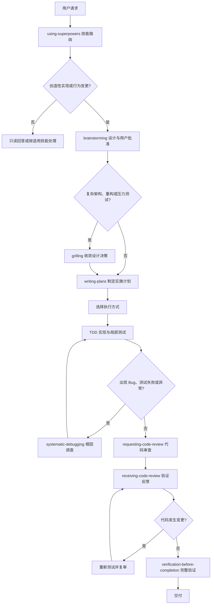

# DevSkill - 智能编程助手技能与工作流集合

DevSkill 是专为 AI Agent（如 Claude Code、Codex、Gemini CLI、Hermes Agent、Antigravity 等）打造的高质量技能（Skills）与工作流规范集合。旨在通过结构化 SOP、深度领域专业知识库、自动化脚本与严格的行为守则，将通用 AI 助手转变为专业的全栈开发与结对编程专家。

---

## ✨ 核心特性

- 🧠 **工程方法论驱动**：内置 TDD（测试驱动开发）、系统化排错、头脑风暴需求探索、极限推敲（Grilling）与内联计划执行等高质量研发工作流。
- ✂️ **反过度工程与极简主义**：集成 Ponytail 7 级决策阶梯，遵循“最好的代码就是没写过的代码”，克制伪需求、过度抽象与冗余依赖，支持极简专向 Review 与技术债追踪。
- 🛠️ **多领域专家技能**：覆盖 Android 原生开发（MD3/Vitals）、iOS 应用开发（SwiftUI/SnapKit/HIG）、界面设计工程与流体动画（Emil Kowalski 经典动效集）、现代旗舰前端（动效/多媒体生成/字体库）、全栈架构、着色器（Shader）等领域。
- 📦 **渐进式资产与知识库**：采用 Progressive Disclosure 渐进式加载，深度知识库（`references/`）、自动化工具（`scripts/`）与模版（`templates/`）按需查阅，**零多余 Token 消耗**。
- 🇨🇳 **本地化工程增强**：提供中文 Code Review 沟通模板、中文技术文档排版规范、国内 Git 平台（Gitee/GitLab/Coding）协作工作流。
- 📐 **严格工业级代码守则**：内置 `AGENTS.md` 11 大核心研发规范，强约束五大流程硬门禁、代码事实源校准、顶部标准导包与阿里规范注释，确保生成代码高质量交付。

---

## 📂 技能库概览 (Skills Index)

### 1. 核心流程与工程方法 (Core Workflows)
| 技能目录 | 作用与适用场景 |
| :--- | :--- |
| **`using-superpowers`** | 技能优先检索与全局调度中枢，确保所有请求在响应前先检查并调用适用的 Skill。 |
| **`brainstorming`** | 头脑风暴与需求探索，在开始任何功能实现前先探索设计方案与用户意图，输出设计规范。 |
| **`grilling`** | 极限推敲与决策树收敛，对技术方案与边界情况进行压力测试，输出明确决策。 |
| **`writing-plans`** | 编写清晰详尽的分步实施计划，包含文件变更清单、检查点与风险分析。 |
| **`executing-plans`** | 计划执行引擎，分批次执行任务并设立审查检查点。 |
| **`test-driven-development`** | 测试驱动开发（TDD）铁律，编写实现代码前先编写并验证失败测试（红-绿-重构循环）。 |
| **`systematic-debugging`** | 系统化排错方法论，遇到异常或 Bug 时严格定位根因，杜绝盲目试错改动。 |
| **`verification-before-completion`** | 完工交付前验证门禁，必须以新鲜的运行输出与测试数据支撑完成断言。 |

### 2. 团队协作与代码审查 (Collaboration & Review)
| 技能目录 | 作用与适用场景 |
| :--- | :--- |
| **`requesting-code-review`** | 请求代码审查，完成重要功能或合并前进行合规性自检与审查准备。 |
| **`receiving-code-review`** | 接收审查反馈，对反馈进行技术验证与精准实施，避免敷衍附和或盲目执行。 |
| **`workflow-runner`** | 跨多角色协作工作流执行引擎，支持本地解析运行 agency-orchestrator 工作流。 |

### 3. 领域开发专家技能 (Domain Development)
| 技能目录 | 核心技术栈与深度知识库 | 作用与适用场景 |
| :--- | :--- | :--- |
| **`android-architecture`** | **NowInAndroid 现代化工程架构**<br>• Offline-First 离线优先架构（Room + Flow）<br>• 多模块化设计（`api` / `impl` 解耦）<br>• Jetpack Compose + MVI/UDF 单向数据流<br>• Hilt 依赖注入、Version Catalog 与 Gradle 约定插件 | 构建符合 Google 官方规范的高质量中大型 Android 项目、多模块拆分、ViewModel + UiState 设计与数据层封装。 |
| **`android-native-dev`** | **Android 原生开发与 Material 3 全流程**<br>• Material Design 3 设计规范（8dp 网格 / 48dp 触控热区）<br>• Android Vitals 4 大核心指标阈值监控（Crash/ANR/耗电/唤醒锁）<br>• 启动性能调优（冷/温/热启动耗时基准与优化）<br>• Product Flavors 多渠道配置与编译错误诊断 | Android 应用端到端开发、MD3 界面设计、无障碍适配、Kotlin 语法避坑、Gradle 构建配置与性能稳定性治理。 |
| **`ios-application-dev`** | **iOS 原生开发与 Apple HIG 规范**<br>• SwiftUI 响应式声明与 UIKit + SnapKit 自动布局<br>• Safe Area、Dynamic Type 动态字体与 Dark Mode 深度指南<br>• Metal Shader 自定义图形与滤镜管线<br>• 导航模式设计、复杂列表调优与无障碍（A11y） | iOS 原生应用开发、Swift 规范编码、Apple 平台 HIG 设计规范审查、动画与视觉特效实现。 |
| **`frontend-dev`** | **旗舰前端工程工作室 (5 大能力矩阵)**<br>• 设计工程：Design Tokens、高质感 UI 与现代化 CSS<br>• 动效系统：GSAP / Framer Motion 滚动视差与微交互<br>• 多媒体 AI 生成：内置 Minimax 脚本（TTS 语音/音乐/视频/图像）<br>• 转化文案（AIDA）与 Canvas 艺术模版、丰富字体库 | 现代化 Web 前端全流程开发、高品质 UI/UX 设计、品牌视觉落地、媒体资产生成与动效开发。 |
| **`fullstack-dev`** | **全栈架构与端到端系统设计**<br>• RESTful API / SSE / WebSocket 接口设计规范与契约<br>• JWT / OAuth2 鉴权链路与安全防护机制<br>• 关系型与 NoSQL 数据库建模与迁移指南<br>• 测试金字塔策略与生产发布检查清单（Release Checklist） | 全栈应用开发、后端服务搭建、前后端接口对接、数据库设计与高可靠生产级交付。 |
| **`shader-dev`** | **图形着色器与渲染特效**<br>• GLSL / HLSL / Metal 着色器开发<br>• 光线步进（Ray Marching）、SDF 建模与流体/粒子系统<br>• 渲染管线与光照/后处理特效计算与 GPU 性能调优 | 2D/3D 视觉特效制作、自定义 Shader 编写、Canvas/WebGL/图形渲染管线开发。 |

### 4. 界面设计工程与高级动效 (Design Engineering & Motion - Emil Kowalski 经典集)
| 技能目录 | 核心技术栈与作用 | 适用场景 |
| :--- | :--- | :--- |
| **`emil-design-eng`** | **旗舰设计工程哲学与手感指南**<br>• Emil Kowalski 核心设计工程原则与隐性细节<br>• 缓动曲线（Easing）决策、半透明阴影与边框品味<br>• 触感交互、过渡时机与手感打磨 | 提升界面设计品味、打磨组件交互细节、解决 AI 界面“粗糙感/廉价感”。 |
| **`animate`** | **现代 Web 动效构建专家**<br>• 从零构建原生 CSS / Framer Motion 动画<br>• 精准匹配曲线参数、时长、阻尼与硬件加速属性<br>• 常见反模式（如入场错用 ease-in）自动纠正 | 从零编写 Web 动画、微交互动画、页面过渡动效。 |
| **`animate-expo`** | **React Native & Expo 原生手感动效**<br>• 复杂手势交互与 BottomSheet 抽屉流体联动<br>• 触觉反馈（Haptics）与原生系统动画结合<br>• 确保动画完全运行在 UI 原生线程（Reanimated），绝不卡顿 | 移动端 React Native 与 Expo 应用动效开发与流畅度优化。 |
| **`review-animations`** | **严格动效审查与代码走查**<br>• 依据行业顶级规范严格审计既有动效实现<br>• 检查过冲、弹跳过激、性能瓶颈与帧率异常 | 动效 Code Review、性能优化与体验把关。 |
| **`improve-animations`** | **全项目动效审计与重构引擎**<br>• 扫描整个代码库中的动画实现并出具自包含改进计划<br>• 输出优先级清晰的重构与打磨清单 | 存量系统动效体验全面翻新与系统化打磨。 |
| **`find-animation-opportunities`** | **动效机会挖掘与克制准则**<br>• 智能识别界面中最能带来情绪价值与指引作用的动效点<br>• 明确标出“坚决不该加动画”的区域，避免过度设计 | 产品交互改版、微交互设计发散与克制评估。 |
| **`animation-vocabulary`** | **动效专业词汇与表达词典**<br>• 动效行业标准术语表（Spring、Stagger、Morphing 等）<br>• 辅助开发者与 AI 形成精确动效语义共识 | 精确表达动效诉求、告别“我想让它稍微动一下”等模糊描述。 |
| **`apple-design`** | **Apple HIG 与流体动画的 Web 转化**<br>• 提炼自 WWDC 官方设计演讲的精髓<br>• 连续曲率、物理动量、分层模糊与流体中断响应 | 追求 Apple 级极致精致手感、高级质感界面的 Web 落地。 |
| **`write-swift`** | **现代化 Swift 编程与并发安全**<br>• 值类型语义、Swift 6 Concurrency 并发模型<br>• 泛型、高性能 Swift 与现代 Swift Testing 框架 | 现代 Swift 原生编程、iOS / macOS 底层逻辑开发。 |
| **`pick-ui-library`** | **工业级 UI 库选型专家**<br>• 依据经过千万级用户验证的现代前端组件生态进行推荐<br>• 杜绝 AI 徒手乱造低劣轮子或引入废弃过时依赖 | 前端脚手架初始化、Toast/Dialog/Select 等核心组件选型。 |
| **`prototype`** | **交互式多方案比稿原型生成器**<br>• 根据需求快速构建多种不同视觉与交互变体（Variants）<br>• 自动注入方案切换器（Switcher），供直观对比体验 | 前期设计探索、多方案视觉/交互决策对比。 |
| **`ask-sonner`** | **Sonner 官方权威指南**<br>• Emil 出品的知名 Toast 库全景指南<br>• 优雅堆叠（Stacked）、状态同步、自定义主题与避坑实战 | 快速接入或高级定制 Sonner 通知组件。 |

### 5. UI/UX 智能设计与设计系统 (UI/UX Intelligence & Design Systems - UI UX Pro Max 体系)
| 技能目录 | 核心技术栈与作用 | 适用场景 |
| :--- | :--- | :--- |
| **`ui-ux-pro-max`** | **全栈 UI/UX 设计智能引擎 (v2.13.0)**<br>• 79 种可搜索 UI 风格（50 种 active，涵盖新拟态/玻璃拟态/便当网格/极简等）<br>• 192 种产品类型专属调色板与推理规则（涵盖 SaaS、电商、金融、医疗等）<br>• 74 种精选字体组合与 Google Fonts 导入、25 种图表类型推荐<br>• 119 条工业级 UX 指南、22 种技术栈（React/Vue/Compose/SwiftUI/Flutter 等）支持<br>• 内置 BM25 + 正则混合搜索与一键设计系统生成推理引擎（`scripts/search.py`） | 页面原型设计、色彩与字体决策、设计系统搭建、无障碍（A11y）合规审计、技术栈专用 UI 代码生成。 |
| **`ui-styling`** | **现代 UI 组件与样式工程**<br>• 结合 shadcn/ui 组件系统（Radix UI 基础）与 Tailwind CSS 实用优先类库<br>• Canvas 可视化设计、海报设计与即时原型反馈<br>• 深度适配暗黑模式（Dark Mode）与响应式移动端断点 | 现代前端组件开发、页面排版与样式美化、主题定制与海报排版。 |
| **`design-system`** | **三层设计令牌与组件工程架构**<br>• Primitive ➔ Semantic ➔ Component 三层设计令牌（Design Tokens）体系<br>• CSS 变量系统构建、间距/字体比例尺与设计到代码的交付契约（Handoff）<br>• 品牌合规的幻灯片/演示文稿生成 | 企业级设计系统沉淀、设计规范落地、组件状态与样式变量标准化。 |
| **`design`** | **全景统一设计专家**<br>• 品牌视觉识别、Logo AI 生成（55 种风格）、企业 VI 识别系统（CIP，50 项交付物）<br>• 社交媒体多平台适配（Facebook/Twitter/LinkedIn/Instagram/TikTok 等）<br>• 矢量图标设计（SVG）、多尺寸 Banner 广告图与设计规范交付 | 品牌形象设计、Logo 与海报生成、社媒多渠道营销视觉物料输出。 |
| **`banner-design`** | **全尺寸横幅与营销图设计**<br>• 涵盖社交媒体封面、广告条（Banner）、网站 Hero 主图、线下印刷等多场景<br>• 支持极简、渐变、立体、粗野、复古等 22 种艺术风格与自包含排版布局 | 营销活动 Banner、网站 Hero 视觉、信息流广告图排版与设计。 |
| **`slides`** | **数据驱动的 HTML 演示文稿生成**<br>• 基于 Chart.js 的交互式数据可视化幻灯片<br>• 结合文案公式（Copywriting Formulas）与结构化排版布局 | 技术分享 PPT、商业商业计划书（Pitch Deck）、数据汇报大屏。 |
| **`brand`** | **品牌语调与资产规范一致性**<br>• 品牌语调（Brand Voice）定义与文案风格指南<br>• 视觉识别标准、资产命名规范与全渠道一致性审查审计 | 品牌资产管理、内容语调把控、跨平台品牌视觉规范走查。 |

### 6. 反过度工程与极简主义 (Anti-Overengineering - Ponytail 体系)
| 技能目录 | 核心技术栈与作用 | 适用场景 |
| :--- | :--- | :--- |
| **`ponytail`** | **极简主义决策阶梯与反过度设计**<br>• 7 级极简决策阶梯（YAGNI ➔ 现有代码复用 ➔ 标准库 ➔ 平台原生 ➔ 一行实现 ➔ 最少代码）<br>• 资深开发者务实准则（“最好的代码就是你没写的代码”，绝不为虚构需求提前设计）<br>• 支持 lite / full / ultra 三级执行强度 | 任何代码编写、重构与架构设计；杜绝样板代码泛滥、单实现假接口与多余依赖。 |
| **`ponytail-review`** | **极简主义专向代码走查**<br>• 专注消除不必要复杂度，给冗余代码精准贴标签（`delete:`, `stdlib:`, `native:`, `yagni:`, `shrink:`）<br>• 追求审查后 Diff 越来越短 | 针对 PR 或 Diff 进行反过度设计审查，精简代码体量。 |
| **`ponytail-audit`** | **全仓库复杂度排查与瘦身审计**<br>• 全面扫描整个代码库，输出按删减价值排序的清理与降重清单<br>• 识别自造轮子并替换为语言标准库或原生能力 | 存量项目瘦身、消除历史包袱、简化系统复杂度。 |
| **`ponytail-debt`** | **极简决策技术债账本管理**<br>• 集中抓取全项目中的 `ponytail:` 临时妥协与上限标记<br>• 明确升级触发条件，防止权宜之计腐化为永久技术债 | 技术债务可视化追踪与渐进式架构演进。 |
| **`ponytail-gain`** | **代码精简收益评分板**<br>• 基于权威基准量化展示减少的代码行数、节省的 Token 与成本下降 | 评估极简架构收益与团队效能度量。 |
| **`ponytail-help`** | **Ponytail 规则与指令速查指南**<br>• 决策阶梯速查、强度切换说明与常用快捷指令 | 快速查阅 Ponytail 规则、强度参数与操作方式。 |

### 7. 中文与本地化规范 (Localization)
| 技能目录 | 作用与适用场景 |
| :--- | :--- |
| **`chinese-documentation`** | 中文技术文档排版指南（遵循中英文混排空格、标点及术语大小写规范）。 |
| **`chinese-code-review`** | 中文 Code Review 话术模板、分级标注（必须修复/建议修改/仅供参考）与反模式应对。 |
| **`chinese-git-workflow`** | 国内 Git 平台（Gitee、极狐 GitLab、Coding 等）配置、SSH/凭据管理与 CI 接入。 |

---

## 🔄 标准工作流与路由决策

> README 负责工作流总览与技能路由；具体触发条件、例外和 SOP 以对应的 `SKILL.md` 为准；项目级强制约束以 [`AGENTS.md`](AGENTS.md) 为准。

### 事实源与主流程

所有请求先通过 `using-superpowers` 判断适用技能。创造性实现进入设计与计划流程；排错和极限推敲按条件触发，不是所有任务都必须顺序经过的固定阶段。



主流程涉及的技能：[`using-superpowers`](using-superpowers/SKILL.md)、[`brainstorming`](brainstorming/SKILL.md)、[`grilling`](grilling/SKILL.md)、[`writing-plans`](writing-plans/SKILL.md)、[`test-driven-development`](test-driven-development/SKILL.md)、[`systematic-debugging`](systematic-debugging/SKILL.md)、[`requesting-code-review`](requesting-code-review/SKILL.md)、[`receiving-code-review`](receiving-code-review/SKILL.md) 和 [`verification-before-completion`](verification-before-completion/SKILL.md)。

### 条件分支

- **极限推敲：** 仅在复杂系统设计、重构、模块拆分、架构决策或用户明确要求压力测试时调用 `grilling`。
- **系统化排错：** 仅在 Bug、测试失败、构建失败、性能问题或异常行为出现时调用 `systematic-debugging`。
- **TDD：** 新功能、Bug 修复、重构和行为变更默认遵循红—绿—重构循环。一次性原型、生成代码或配置文件等例外，必须先征得用户同意。
- `grilling` 和 `systematic-debugging` 都是条件分支，不应被理解为每次开发都要依次执行的固定阶段。

### 执行方式选择

计划获批后，根据任务依赖、会话位置和平台能力选择一种执行方式：

| 场景 | 使用技能 | 选择依据 |
| :--- | :--- | :--- |
| 普通任务 | 当前会话内联执行 | 默认方式，不再重复询问执行方式 |
| 需要分批检查点或单独会话执行书面计划 | [`executing-plans`](executing-plans/SKILL.md) | 批量执行计划，并在检查点汇报 |
| 用户提供 YAML 工作流，或明确要求多个角色协作 | [`workflow-runner`](workflow-runner/SKILL.md) | 按依赖关系拓扑执行角色步骤 |

### 阶段产物与质量门禁

| 阶段 | 主要产物 | 进入下一阶段的门禁 |
| :--- | :--- | :--- |
| [`brainstorming`](brainstorming/SKILL.md) | 用户批准的设计规格 | 设计未获批准，不得进入实现 |
| [`grilling`](grilling/SKILL.md) | 收敛的设计树、上下文或 ADR | 仅复杂决策按需执行，关键分歧必须先收敛 |
| [`writing-plans`](writing-plans/SKILL.md) | 包含精确文件、步骤和验证命令的实施计划 | 计划必须通过覆盖度、占位符和一致性自检 |
| [`test-driven-development`](test-driven-development/SKILL.md) | 红—绿—重构证据 | 没有验证过的失败测试，不得编写生产代码 |
| Code Review | 分级发现及逐项技术裁定 | 承重问题必须修复并复审 |
| [`verification-before-completion`](verification-before-completion/SKILL.md) | 当前变更对应的完整测试、构建或静态检查输出 | 没有新鲜证据，不得宣称完成 |

### 审查、验证与暂停条件

交付顺序固定为：

```text
实现与局部测试 → Code Review → 验证反馈 → 修复与复审 → 完整验证 → 交付
```

审查后只要代码发生变化，之前的验证证据就会失效，必须重新运行相关测试、构建或静态检查。遇到以下情况时应暂停执行并请求用户决策：

- 关键需求存在会改变最终结果的歧义；
- 后续操作需要扩大用户已经授权的范围；
- TDD 例外尚未获得用户批准；
- 连续审查后仍存在影响正确性或交付的承重问题；
- 当前环境无法提供足以支撑完成断言的验证证据。

---

## 🚀 安装与使用指南

> 💡 **AI 一键安装与上游同步**：你可以直接查看 [INSTALL.md](INSTALL.md) 进行一键全自动安装，或查看 [UPDATE.md](UPDATE.md) 了解如何从上游开源项目（superpowers-zh、MiniMax-AI/skills、mattpocock/skills、emilkowalski/skills、DietrichGebert/ponytail 等）同步与更新最新技能库。

---

### 方式一：作为全局技能引入（推荐）

将技能文件夹复制到对应客户端的全局配置目录：

- **Antigravity / Gemini CLI**:
  - **Windows (PowerShell 推荐)**:
    ```powershell
    Get-ChildItem -Directory | Where-Object { $_.Name -notlike ".*" } | Copy-Item -Destination "$HOME\.gemini\config\skills" -Recurse -Force
    ```
  - **Windows (CMD)**:
    ```cmd
    xcopy /E /I /Y * "%USERPROFILE%\.gemini\config\skills\"
    ```
  - **macOS / Linux**:
    ```bash
    cp -r */ ~/.gemini/config/skills/
    ```

- **Codex**:
  - **Windows (PowerShell 推荐)**:
    ```powershell
    Get-ChildItem -Directory | Where-Object { $_.Name -notlike ".*" } | Copy-Item -Destination "$HOME\.codex\skills" -Recurse -Force
    ```
  - **Windows (CMD)**:
    ```cmd
    xcopy /E /I /Y * "%USERPROFILE%\.codex\skills\"
    ```
  - **macOS / Linux**:
    ```bash
    cp -r */ ~/.codex/skills/
    ```

- **Claude Code**:
  - **macOS / Linux**:
    ```bash
    cp -r * ~/.claude/skills/
    ```

### 方式二：作为项目级技能引入

在你的项目根目录下创建 `.agents/skills` 目录，并将所需技能放入其中：

```bash
mkdir -p .agents/skills
cp -r /path/to/DevSkill/<skill-name> .agents/skills/
```

并在项目根目录下放置 `AGENTS.md`，使项目成员和 Agent 保持一致的工作习惯。

---

## 📜 工作流规范配置 (AGENTS.md)

本项目根目录下提供了开箱即用的 `AGENTS.md`，内含 **11 大核心研发规范**，用于约束 Agent 的底层行为：

1. **指令优先级与授权边界**：明确用户指令与项目 `AGENTS.md` 的最高优先级，未经授权严禁擅自提交、推送或修改外部系统。
2. **人设与称谓定制**：支持灵活定制 Agent 角色设定与交互称呼。
3. **Skill 优先与五大质量硬门禁**：前置路由执行 `using-superpowers`；设计批准门禁、TDD 门禁、根因排查门禁（`systematic-debugging`）、代码审查门禁与交付验证门禁（`verification-before-completion`）。
4. **授权、暂停与工作区保护**：遇到关键需求歧义或验证失败时强制暂停；严禁破坏性覆盖未跟踪资产。
5. **回答复盘与透明度规范**：末尾强制显式总结「本次回答使用的 Skill」，并附带本地链接与职责说明。
6. **代码事实源与零假设校准**：零信任代码记忆（Zero-Trust Memory），先查磁盘最新状态再动笔，支持 Grep 先行与区间切片读取。
7. **导包、成员布局与注释规范**：顶部标准导入、严禁长路径内联；常量与状态集中布局；公共 API 规范文档注释。
8. **Android 构建与验证规范**：Gradle Wrapper 跨平台适配、动态探测 Flavor 与变体、分层验证策略。
9. **前后端构建与验证规范**：前端分流快速构建、编译日志静默纪律（构建成功静默、失败强制折叠收起）。
10. **iOS 构建与验证规范**：Workspace/Project 动态探测、Debug 模拟器快速编译验证与静默日志规范。
11. **文档归档与管理规范 (Documentation Management Mandate)**：研发过程文档必须统一归档至 `docs/` 目录，命名规范，严禁污染项目根目录。

---

## 🤝 参与贡献

欢迎提交 Issue 和 Pull Request 来完善技能库！
- 如果你设计了新的专业领域 Skill，请遵循标准 YAML Frontmatter 格式编写 `SKILL.md`，可按需补充 `references/`、`scripts/` 与 `templates/`。
- 中文文档与技能描述请遵循 `chinese-documentation` 排版规范。

---

## 📄 许可证

本项目采用 [MIT License](LICENSE) 授权。
