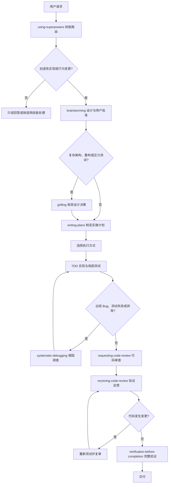

# DevSkill - 智能编程助手技能与工作流集合

DevSkill 是专为 AI Agent（如 Claude Code、Codex、Gemini CLI、Hermes Agent、Antigravity 等）打造的高质量技能（Skills）与工作流规范集合。旨在通过结构化 SOP、深度领域专业知识库、自动化脚本与严格的行为守则，将通用 AI 助手转变为专业的全栈开发与结对编程专家。

---

## ✨ 核心特性

- 🧠 **工程方法论驱动**：内置 TDD（测试驱动开发）、系统化排错、头脑风暴需求探索、极限推敲（Grilling）与子智能体驱动开发（SDD）等高质量研发工作流。
- 🛠️ **多领域专家技能**：覆盖 Android 原生开发（MD3/Vitals）、iOS 应用开发（SwiftUI/SnapKit/HIG）、现代旗舰前端（动效/多媒体生成/字体库）、全栈架构、着色器（Shader）等领域。
- 📦 **渐进式资产与知识库**：采用 Progressive Disclosure 渐进式加载，深度知识库（`references/`）、自动化工具（`scripts/`）与模版（`templates/`）按需查阅，**零多余 Token 消耗**。
- 🇨🇳 **本地化工程增强**：提供中文 Code Review 沟通模板、中文技术文档排版规范、国内 Git 平台（Gitee/GitLab/Coding）协作工作流。
- 📐 **严格工业级代码守则**：内置 `AGENTS.md` 8 大行为准则，强约束三大流程硬门禁、代码事实源校准、顶部标准导包与阿里规范注释，确保生成代码高质量交付。

---

## 📂 技能库概览 (Skills Index)

### 1. 核心流程与工程方法 (Core Workflows)
| 技能目录 | 作用与适用场景 |
| :--- | :--- |
| **`using-superpowers`** | 技能优先检索与全局调度中枢，确保所有请求在响应前先检查并调用适用的 Skill。 |
| **`brainstorming`** | 头脑风暴与需求探索，在开始任何功能实现前先探索设计方案与用户意图，输出设计规范。 |
| **`grilling`** | 极限推敲与决策树收敛，对技术方案与边界情况进行压力测试，输出明确决策。 |
| **`writing-plans`** | 编写清晰详尽的分步实施计划，包含文件变更清单、检查点与风险分析。 |
| **`executing-plans`** | 计划执行引擎，分批次执行任务并设立审查检查点。 |
| **`test-driven-development`** | 测试驱动开发（TDD）铁律，编写实现代码前先编写并验证失败测试（红-绿-重构循环）。 |
| **`systematic-debugging`** | 系统化排错方法论，遇到异常或 Bug 时严格定位根因，杜绝盲目试错改动。 |
| **`verification-before-completion`** | 完工交付前验证门禁，必须以新鲜的运行输出与测试数据支撑完成断言。 |

### 2. 团队协作与代码审查 (Collaboration & Review)
| 技能目录 | 作用与适用场景 |
| :--- | :--- |
| **`subagent-driven-development`** | 子智能体驱动开发（SDD），为每个任务分派隔离子智能体，执行单任务双重审查与全分支宽范围审查。 |
| **`dispatching-parallel-agents`** | 分发并行子智能体，处理无状态依赖的独立并行任务。 |
| **`requesting-code-review`** | 请求代码审查，完成重要功能或合并前进行合规性自检与审查准备。 |
| **`receiving-code-review`** | 接收审查反馈，对反馈进行技术验证与精准实施，避免敷衍附和或盲目执行。 |
| **`workflow-runner`** | 跨多角色协作工作流执行引擎，支持本地解析运行 agency-orchestrator 工作流。 |

### 3. 领域开发专家技能 (Domain Development)
| 技能目录 | 核心技术栈与深度知识库 | 作用与适用场景 |
| :--- | :--- | :--- |
| **`android-architecture`** | **NowInAndroid 现代化工程架构**<br>• Offline-First 离线优先架构（Room + Flow）<br>• 多模块化设计（`api` / `impl` 解耦）<br>• Jetpack Compose + MVI/UDF 单向数据流<br>• Hilt 依赖注入、Version Catalog 与 Gradle 约定插件 | 构建符合 Google 官方规范的高质量中大型 Android 项目、多模块拆分、ViewModel + UiState 设计与数据层封装。 |
| **`android-native-dev`** | **Android 原生开发与 Material 3 全流程**<br>• Material Design 3 设计规范（8dp 网格 / 48dp 触控热区）<br>• Android Vitals 4 大核心指标阈值监控（Crash/ANR/耗电/唤醒锁）<br>• 启动性能调优（冷/温/热启动耗时基准与优化）<br>• Product Flavors 多渠道配置与编译错误诊断 | Android 应用端到端开发、MD3 界面设计、无障碍适配、Kotlin 语法避坑、Gradle 构建配置与性能稳定性治理。 |
| **`ios-application-dev`** | **iOS 原生开发与 Apple HIG 规范**<br>• SwiftUI 响应式声明与 UIKit + SnapKit 自动布局<br>• Safe Area、Dynamic Type 动态字体与 Dark Mode 深度指南<br>• Metal Shader 自定义图形与滤镜管线<br>• 导航模式设计、复杂列表调优与无障碍（A11y） | iOS 原生应用开发、Swift 规范编码、Apple 平台 HIG 设计规范审查、动画与视觉特效实现。 |
| **`frontend-dev`** | **旗舰前端工程工作室 (5 大能力矩阵)**<br>• 设计工程：Design Tokens、高质感 UI 与现代化 CSS<br>• 动效系统：GSAP / Framer Motion 滚动视差与微交互<br>• 多媒体 AI 生成：内置 Minimax 脚本（TTS 语音/音乐/视频/图像）<br>• 转化文案（AIDA）与 Canvas 艺术模版、丰富字体库 | 现代化 Web 前端全流程开发、高品质 UI/UX 设计、品牌视觉落地、媒体资产生成与动效开发。 |
| **`fullstack-dev`** | **全栈架构与端到端系统设计**<br>• RESTful API / SSE / WebSocket 接口设计规范与契约<br>• JWT / OAuth2 鉴权链路与安全防护机制<br>• 关系型与 NoSQL 数据库建模与迁移指南<br>• 测试金字塔策略与生产发布检查清单（Release Checklist） | 全栈应用开发、后端服务搭建、前后端接口对接、数据库设计与高可靠生产级交付。 |
| **`shader-dev`** | **图形着色器与渲染特效**<br>• GLSL / HLSL / Metal 着色器开发<br>• 光线步进（Ray Marching）、SDF 建模与流体/粒子系统<br>• 渲染管线与光照/后处理特效计算与 GPU 性能调优 | 2D/3D 视觉特效制作、自定义 Shader 编写、Canvas/WebGL/图形渲染管线开发。 |

### 4. 中文与本地化规范 (Localization)
| 技能目录 | 作用与适用场景 |
| :--- | :--- |
| **`chinese-documentation`** | 中文技术文档排版指南（遵循中英文混排空格、标点及术语大小写规范）。 |
| **`chinese-code-review`** | 中文 Code Review 话术模板、分级标注（必须修复/建议修改/仅供参考）与反模式应对。 |
| **`chinese-git-workflow`** | 国内 Git 平台（Gitee、极狐 GitLab、Coding 等）配置、SSH/凭据管理与 CI 接入。 |

---

## 🔄 标准工作流与路由决策

> README 负责工作流总览与技能路由；具体触发条件、例外和 SOP 以对应的 `SKILL.md` 为准；项目级强制约束以 [`AGENTS.md`](AGENTS.md) 为准。

### 事实源与主流程

所有请求先通过 `using-superpowers` 判断适用技能。创造性实现进入设计与计划流程；排错和极限推敲按条件触发，不是所有任务都必须顺序经过的固定阶段。



主流程涉及的技能：[`using-superpowers`](using-superpowers/SKILL.md)、[`brainstorming`](brainstorming/SKILL.md)、[`grilling`](grilling/SKILL.md)、[`writing-plans`](writing-plans/SKILL.md)、[`test-driven-development`](test-driven-development/SKILL.md)、[`systematic-debugging`](systematic-debugging/SKILL.md)、[`requesting-code-review`](requesting-code-review/SKILL.md)、[`receiving-code-review`](receiving-code-review/SKILL.md) 和 [`verification-before-completion`](verification-before-completion/SKILL.md)。

### 条件分支

- **极限推敲：** 仅在复杂系统设计、重构、模块拆分、架构决策或用户明确要求压力测试时调用 `grilling`。
- **系统化排错：** 仅在 Bug、测试失败、构建失败、性能问题或异常行为出现时调用 `systematic-debugging`。
- **TDD：** 新功能、Bug 修复、重构和行为变更默认遵循红—绿—重构循环。一次性原型、生成代码或配置文件等例外，必须先征得用户同意。
- `grilling` 和 `systematic-debugging` 都是条件分支，不应被理解为每次开发都要依次执行的固定阶段。

### 执行方式选择

计划获批后，根据任务依赖、会话位置和平台能力选择一种执行方式：

| 场景 | 使用技能 | 选择依据 |
| :--- | :--- | :--- |
| 当前会话已有书面计划，任务基本独立，且平台支持子 Agent | [`subagent-driven-development`](subagent-driven-development/SKILL.md) | 每个任务使用隔离子 Agent，并执行任务级与最终审查 |
| 在单独会话中执行书面计划，或无法使用子 Agent | [`executing-plans`](executing-plans/SKILL.md) | 批量执行计划，并在检查点汇报 |
| 存在 2 个以上互不依赖、无共享状态的即时任务 | [`dispatching-parallel-agents`](dispatching-parallel-agents/SKILL.md) | 并行收集结果；不用于存在顺序依赖的任务 |
| 用户提供 YAML 工作流，或明确要求多个角色协作 | [`workflow-runner`](workflow-runner/SKILL.md) | 按依赖关系拓扑执行角色步骤 |

### 阶段产物与质量门禁

| 阶段 | 主要产物 | 进入下一阶段的门禁 |
| :--- | :--- | :--- |
| [`brainstorming`](brainstorming/SKILL.md) | 用户批准的设计规格 | 设计未获批准，不得进入实现 |
| [`grilling`](grilling/SKILL.md) | 收敛的设计树、上下文或 ADR | 仅复杂决策按需执行，关键分歧必须先收敛 |
| [`writing-plans`](writing-plans/SKILL.md) | 包含精确文件、步骤和验证命令的实施计划 | 计划必须通过覆盖度、占位符和一致性自检 |
| [`test-driven-development`](test-driven-development/SKILL.md) | 红—绿—重构证据 | 没有验证过的失败测试，不得编写生产代码 |
| Code Review | 分级发现及逐项技术裁定 | 承重问题必须修复并复审 |
| [`verification-before-completion`](verification-before-completion/SKILL.md) | 当前变更对应的完整测试、构建或静态检查输出 | 没有新鲜证据，不得宣称完成 |

### 审查、验证与暂停条件

交付顺序固定为：

```text
实现与局部测试 → Code Review → 验证反馈 → 修复与复审 → 完整验证 → 交付
```

审查后只要代码发生变化，之前的验证证据就会失效，必须重新运行相关测试、构建或静态检查。遇到以下情况时应暂停执行并请求用户决策：

- 关键需求存在会改变最终结果的歧义；
- 后续操作需要扩大用户已经授权的范围；
- TDD 例外尚未获得用户批准；
- 连续审查后仍存在影响正确性或交付的承重问题；
- 当前环境无法提供足以支撑完成断言的验证证据。

---

## 🚀 安装与使用指南

> 💡 **AI 一键安装与上游同步**：你可以直接查看 [INSTALL.md](INSTALL.md) 进行一键全自动安装，或查看 [UPDATE.md](UPDATE.md) 了解如何从上游开源项目（superpowers-zh、MiniMax-AI/skills、mattpocock/skills 等）同步与更新最新技能库。

---

### 方式一：作为全局技能引入（推荐）

将技能文件夹复制到对应客户端的全局配置目录：

- **Antigravity / Gemini CLI**:
  - **Windows (PowerShell)**:
    ```powershell
    Copy-Item -Path ".\*" -Destination "$HOME\.gemini\config\skills" -Recurse -Force
    ```
  - **Windows (CMD)**:
    ```cmd
    xcopy /E /I /Y * "%USERPROFILE%\.gemini\config\skills\"
    ```
  - **macOS / Linux**:
    ```bash
    cp -r * ~/.gemini/config/skills/
    ```

- **Codex**:
  - **Windows (PowerShell)**:
    ```powershell
    Copy-Item -Path ".\*" -Destination "$HOME\.codex\skills" -Recurse -Force
    ```
  - **Windows (CMD)**:
    ```cmd
    xcopy /E /I /Y * "%USERPROFILE%\.codex\skills\"
    ```
  - **macOS / Linux**:
    ```bash
    cp -r * ~/.codex/skills/
    ```

- **Claude Code**:
  - **macOS / Linux**:
    ```bash
    cp -r * ~/.claude/skills/
    ```

### 方式二：作为项目级技能引入

在你的项目根目录下创建 `.agents/skills` 目录，并将所需技能放入其中：

```bash
mkdir -p .agents/skills
cp -r /path/to/DevSkill/<skill-name> .agents/skills/
```

并在项目根目录下放置 `AGENTS.md`，使项目成员和 Agent 保持一致的工作习惯。

---

## 📜 工作流规范配置 (AGENTS.md)

本项目根目录下提供了开箱即用的 `AGENTS.md`，内含 **8 大核心研发守则**，用于约束 Agent 的底层行为：

1. **Skill 优先与三大硬门禁**：前置执行 `using-superpowers` 路由；强制推敲（`grilling`）、根因排错（`systematic-debugging`）、完工前验证（`verification-before-completion`）。
2. **人设与称呼定制**：支持个性化角色设定与交互称谓。
3. **执行透明与闭环审计**：回答末尾强制保留「总结：本次回答使用的 Skill」小结。
4. **跨语言顶部标准导包**：强制顶部显式声明 `import`，严禁长路径内联调用，杜绝漏导包。
5. **代码事实源与阅读校准**：零假设施工（Zero-Trust Memory），Grep 先行 + 精准切片（Slice Viewing）校准真实磁盘代码。
6. **类结构与成员集中声明**：伴生对象、常量、状态与属性统一在顶部集中声明并附带规范注释。
7. **阿里巴巴 Javadoc/KDoc 注释规范**：类、方法、属性强制使用 `/** ... */` 标准注释，要素完整（`@param`、`@return`）。
8. **Android 常用编译与构建指令规范**：跨操作系统（macOS/Linux/Windows）与多 Flavor 变体动态适配构建。

---

## 🤝 参与贡献

欢迎提交 Issue 和 Pull Request 来完善技能库！
- 如果你设计了新的专业领域 Skill，请遵循标准 YAML Frontmatter 格式编写 `SKILL.md`，可按需补充 `references/`、`scripts/` 与 `templates/`。
- 中文文档与技能描述请遵循 `chinese-documentation` 排版规范。

---

## 📄 许可证

本项目采用 [MIT License](LICENSE) 授权。
